# Fossil vs Solar Electricity Generation: 

## How We Make Electricity: Two Different Paths

Below are simplified flow diagrams showing how electricity is generated from fossil fuels versus solar energy.

---

## 🔥 Fossil Fuel Electricity Generation

```mermaid
flowchart TD
    A[🪨 Fossil Fuels<br/>Coal, Oil, Natural Gas] --> B[🔥 Burn Fuel<br/>Creates Heat]
    B --> C[💧 Heat Water<br/>Makes Steam]
    C --> D[⚙️ Steam Spins Turbine<br/>Mechanical Energy]
    D --> E[🔌 Generator Creates<br/>Electricity]
    E --> F[📡 Power Lines<br/>Deliver to Homes]
    
    style A fill:#8B4513
    style B fill:#FF4500
    style C fill:#043f4a
    style D fill:#2b2501
    style E fill:#32CD32
    style F fill:#FF69B4
```

### Step-by-Step Explanation:

1. **🪨 Extract Fossil Fuels**: We dig up coal, pump oil, or extract natural gas from the ground
2. **🔥 Burn the Fuel**: The fuel is burned in a power plant, creating intense heat
3. **💧 Create Steam**: This heat boils water, turning it into high-pressure steam
4. **⚙️ Spin Turbines**: The steam pushes against turbine blades, making them spin rapidly
5. **🔌 Generate Electricity**: The spinning turbine turns a generator that creates electricity
6. **📡 Distribution**: Power lines carry electricity to your home

**⚠️ Environmental Impact**: Burning fossil fuels releases CO₂ and other pollutants into the atmosphere.

---

## ☀️ Solar Electricity Generation

```mermaid
flowchart TD
    A[☀️ Sunlight<br/>Solar Energy] --> B[🔷 Solar Panel<br/>Photovoltaic Cells]
    B --> C[⚡ Direct Current<br/>DC Electricity]
    C --> D[🔄 Inverter<br/>Converts DC to AC]
    D --> E[🏠 Usable Electricity<br/>Powers Your Home]
    E --> F[🔋 Excess to Grid<br/>or Battery Storage]
    
    style A fill:#736105
    style B fill:#4169E1
    style C fill:#FF6347
    style D fill:#32CD32
    style E fill:#9370DB
    style F fill:#20B2AA
```

### Step-by-Step Explanation:

1. **☀️ Sunlight Hits Panels**: Solar panels are positioned to capture sunlight throughout the day
2. **🔷 Photovoltaic Effect**: Special cells in the panel convert light directly into electricity
3. **⚡ DC Electricity**: The panels produce Direct Current (DC) electricity, like a battery
4. **🔄 Convert to AC**: An inverter changes DC to Alternating Current (AC) for home use
5. **🏠 Power Your Home**: The AC electricity can now run your appliances and lights
6. **🔋 Store or Share**: Extra electricity can be stored in batteries or sold back to the power grid

**🌱 Environmental Impact**: Solar energy produces no emissions during operation and uses a renewable resource.

---

## 📊 Quick Comparison

| Aspect | Fossil Fuels | Solar Energy |
|--------|-------------|--------------|
| **Energy Source** | Coal, Oil, Gas (finite) | Sunlight (infinite) |
| **Process** | Burn → Heat → Steam → Spin → Electricity | Light → Direct Electricity |
| **Steps** | 6 steps with energy loss at each | 4 steps with minimal loss |
| **Emissions** | High CO₂ and pollutants | Zero during operation |
| **Fuel Cost** | Ongoing (buy fuel forever) | Free after installation |
| **Weather Dependent** | No | Yes (needs sunlight) |
| **Setup Complexity** | Very complex power plants | Relatively simple installation |

---

## 🤔 Key Takeaways

- **Fossil fuels** use a **multi-step process**: burn fuel → make steam → spin turbines → generate electricity
- **Solar panels** create electricity **directly** from sunlight using the "photovoltaic effect"
- **Efficiency**: Solar is more direct (fewer energy conversion steps = less energy lost)
- **Environment**: Fossil fuels pollute during operation; solar panels are clean during operation
- **Cost**: Fossil fuels require ongoing fuel purchases; solar has high upfront cost but free "fuel" (sunlight)

---

## 🔬 Fun Science Facts

- **Photovoltaic** means "light-voltage" - literally making electricity from light!
- A typical coal plant is only about **35% efficient** (65% of energy is lost as waste heat)
- Solar panels are about **15-22% efficient** but the "fuel" (sunlight) is free and unlimited
- One hour of sunlight hitting Earth contains enough energy to power the world for a year!

---

*This diagram shows simplified versions of these processes. Real power plants and solar installations have additional components for safety, efficiency, and grid integration.*
